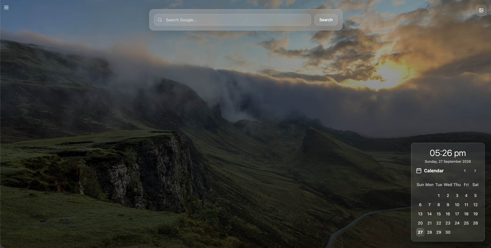
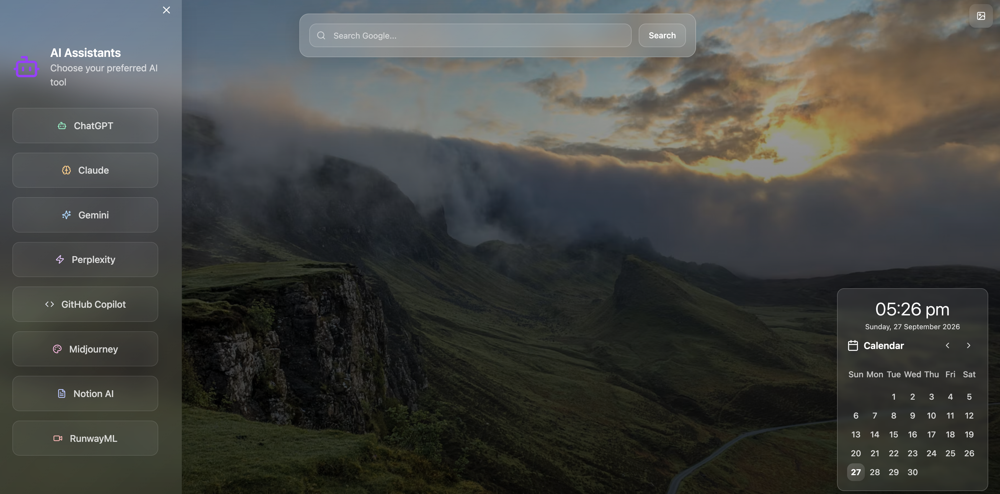
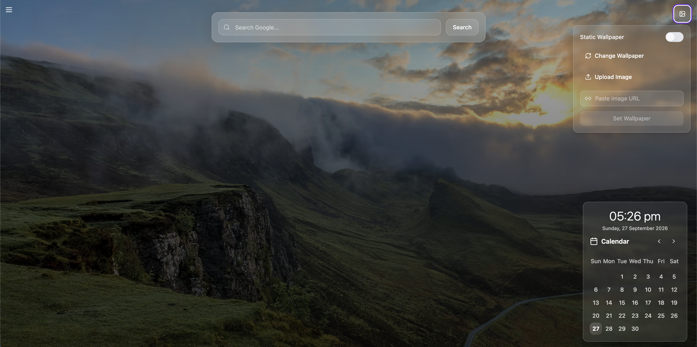

# 🎨 Fresh Canvas – Modern Chrome New Tab Extension

[](https://developer.chrome.com/docs/extensions/)
[](https://reactjs.org/)
[](https://www.typescriptlang.org/)
[](https://vitejs.dev/)
[](https://tailwindcss.com/)

**Fresh Canvas** transforms your default Chrome "New Tab" page into a sleek, functional, and visually captivating personal workspace. Powered by glassmorphism UI, real-time clock widgets, customizable high-definition wallpapers, integrated calendar view, and quick access launchers for leading AI tools.

---

## 📸 Screenshots & Showcase

| Main Dashboard | Widgets & AI Tools | Wallpaper Controls |
| :---: | :---: | :---: |
|  |  |  |

---

## ✨ Key Features

- 🖼️ **Dynamic Wallpaper Engine**
  - High-definition HD curated Unsplash photo rotation.
  - Upload custom local background images or set custom image URLs.
  - Toggle between **Static Mode** (lock favorite wallpaper) and **Dynamic Mode** (auto-rotate on new tab).
  - All wallpaper settings persist seamlessly in local storage.

- 🤖 **AI Tools Launcher**
  - One-click quick launcher for top AI productivity tools: **ChatGPT, Claude, Gemini, Perplexity, GitHub Copilot, Midjourney, Notion AI, RunwayML**.

- 🔍 **Universal Glassmorphism Search Bar**
  - Integrated search box to query Google instantly without leaving your dashboard tab.

- 📅 **Integrated Interactive Calendar**
  - Full-featured calendar grid with smooth month navigation to keep track of dates at a glance.

- 📐 **Collapsible Sidebar UI**
  - Retractable side panel built with frosted glass styling to keep your main workspace minimal and clutter-free.

- ⚡ **Lightweight & Privacy-First**
  - Zero third-party trackers, zero ads, 100% offline data execution stored entirely inside your browser.

---

## 📂 Download & Manual Installation

You can install Fresh Canvas manually in Chrome or any Chromium-based browser without needing the Chrome Web Store.

### 📥 Step 1: Download
Download the pre-packaged ZIP archive:

👉 **[Download Fresh Canvas Extension (Google Drive)](https://drive.google.com/drive/folders/1Zrof358Tb5c0sZjt2JW1u2ucgimWtQYj?usp=sharing)**

---

### 🧩 Step 2: Install in Chrome

1. Open **Google Chrome** and navigate to `chrome://extensions/` (or go to **Menu > Extensions > Manage Extensions**).
2. Enable **Developer Mode** using the toggle in the top-right corner.
3. Extract (unzip) the downloaded `Fresh-Canvas` ZIP file on your computer.
4. Click the **"Load unpacked"** button in Chrome.
5. Select the extracted folder.
6. Open a new tab to experience **Fresh Canvas**! 🎉

---

### 🌐 Step 3: Install in Other Chromium Browsers

Fresh Canvas is fully compatible with all Chromium browsers:
- **Brave**: Navigate to `brave://extensions/`
- **Microsoft Edge**: Navigate to `edge://extensions/`
- **Opera**: Navigate to `opera://extensions/`

*Follow the exact same "Load unpacked" steps as described above.*

---

## 🛠️ Tech Stack

- **Framework**: [React 18](https://reactjs.org/) + [TypeScript](https://www.typescriptlang.org/)
- **Bundler**: [Vite](https://vitejs.dev/)
- **Styling**: [Tailwind CSS](https://tailwindcss.com/) + Glassmorphism Effects + [Shadcn UI](https://ui.shadcn.com/)
- **Icons**: [Lucide React](https://lucide.dev/)
- **State & Storage**: Browser `localStorage` + React Hooks

---

## 🚀 Development Setup

If you wish to build or customize the extension source code locally:

### 1. Prerequisites
- [Node.js](https://nodejs.org/) (v18+ recommended)
- `npm` or `bun`

### 2. Clone repository & install dependencies
```bash
git clone https://github.com/your-username/fresh-canvas-extension.git
cd fresh-canvas-extension
npm install
```

### 3. Run Development Server
```bash
npm run dev
```

### 4. Build Production Extension Bundle
```bash
npm run build
```
The compiled, ready-to-load extension files will be placed into the `dist/` directory.

---

## 📁 Project Structure

```text
fresh-canvas-extension/
├── public/                 # Extension manifest & static assets
├── screenshots/            # Showcase images for README
│   ├── dashboard.png
│   ├── widgets.png
│   └── wallpaper-controls.png
├── src/
│   ├── components/         # Core UI components
│   │   ├── CalendarComponent.tsx   # Interactive calendar grid
│   │   ├── RightSidebar.tsx        # Retractable glass panel
│   │   ├── SearchAndTools.tsx      # Search bar & AI quick launcher
│   │   └── WallpaperExtension.tsx  # Main wallpaper & clock container
│   ├── pages/              # Main route views
│   ├── background.ts       # Service worker script
│   ├── content.ts          # Content script
│   └── index.css           # Glassmorphism & global styles
├── package.json
└── vite.config.ts
```

---

## 🤝 Contributing & Feedback

Contributions, issue reports, and feature requests are welcome!  
If you enjoy using **Fresh Canvas**, please star ⭐️ this repository!

---

## 📄 License

This project is open-source and available under the [MIT License](LICENSE).
